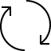

[](https://github.com/jp2masa/Movere/actions/workflows/build.yml)

| Package            | NuGet                                                                                                                 | MyGet                                                                                                                                                         |
| ------------------ | --------------------------------------------------------------------------------------------------------------------- | ------------------------------------------------------------------------------------------------------------------------------------------------------------- |
| Movere             | [](https://www.nuget.org/packages/Movere/)                         | [](https://www.myget.org/feed/jp2masa/package/nuget/Movere)                         |
| Movere.FileDialogs | [](https://www.nuget.org/packages/Movere.FileDialogs/) | [](https://www.myget.org/feed/jp2masa/package/nuget/Movere.FileDialogs) |
| Movere.Win32       | [](https://www.nuget.org/packages/Movere.Win32/)             | [](https://www.myget.org/feed/jp2masa/package/nuget/Movere.Win32)             |

# Movere



Movere is an implementation of managed dialogs for Avalonia. Currently there are message dialogs, as well as open and save file dialogs, and a print dialog (based on `System.Drawing.Printing`) is WIP.

## Getting Started

### Registering file dialogs with Avalonia

To use Avalonia storage provider APIs, it's possible to simply register Movere dialogs with `AppBuilder`:

1. Import `Movere` namespace:

```cs
using Movere;
```

2. Add `UseMovereStorageProvider` to `AppBuilder` configuration. Example:

```cs
AppBuilder.Configure<App>()
    .UsePlatformDetect()
    .UseMovereStorageProvider();
```

3. Then use Avalonia system dialog APIs. Example:

```cs
var options = new FilePickerOpenOptions()
{
    ...
};

var result = parent.StorageProvider.OpenFilePickerAsync(options);
```

#### (Deprecated) System Dialog APIs

If using the old system dialogs APIs, the `AppBuilder` extension method is `UseMovereSystemDialogs` and an example is:

```cs
var dialog = new OpenFileDialog();
var result = await dialog.ShowAsync(parent);
```

### Using dialog hosts

To simply use the dialogs (this example is for message dialogs, but it's similar for others):

1. Create a dialog host for the `owner`:

```cs
var dialogHost = new WindowDialogHost(owner);
// OR
var dialogHost = new OverlayDialogHost(owner);
```

2. Pass the host to the view model:

```cs
window.DataContext = new ViewModel(dialogHost);
```

3. Show dialog from the view model when you need to:

```cs
private Task ShowInfoAsync() =>
    _dialogHost
        .ShowMessageDialog(
            new MessageDialogOptions((LocalizedString)"Message Dialog", "Some info")
            {
                Icon = AvaloniaDialogIcon.Info,
                DialogResults = DialogResultSet.OK
            }
        );
```

Available icons are:

- `DialogIcon.None`
- `AvaloniaDialogIcon.Info`
- `AvaloniaDialogIcon.Warning`
- `AvaloniaDialogIcon.Error`

To add your own icon, just call `AvaloniaDialogIcon.TryCreate`, passing the
resource string, e.g `avares://My.App/Resources/Icons/MyIcon.png`.

Dialog results are extensible as well, and support localization.

## Roadmap

- Maybe separate file explorer view into separate project.
- Improve styles for dialogs.
- Add tests.
- Print dialog.
- Eventually move file explorer logic to a separate project and create a file explorer application.

## Credits

### Icons

#### [flaticon.com](https://www.flaticon.com)
- File - [Kiranshastry](https://www.flaticon.com/authors/kiranshastry)
- Folder - [Smashicons](https://www.flaticon.com/authors/smashicons)

### _The project logo is from [linea.io](http://linea.io)._
